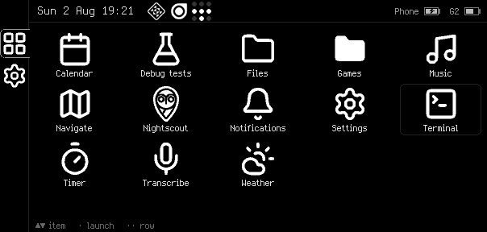
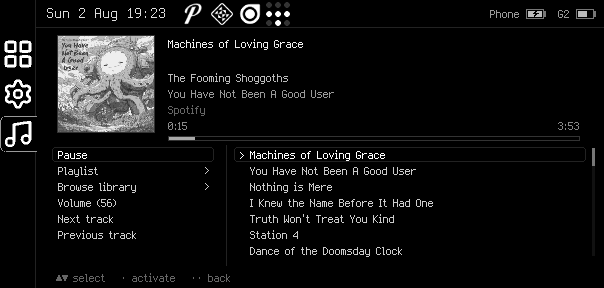
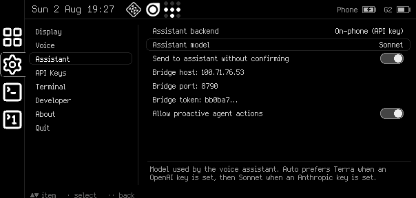
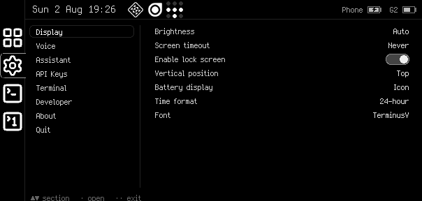

# Faceclaw - An unofficial user interface for the Even Realities G2 smart glasses

This is an unofficial user interface for the Even Realities G2 smart glasses.
It is entirely unofficial, and comes with no support or warranty from Even
Realities or from anyone.

This app runs on Android, and requires installing custom firmware on the
glasses. The Android app itself can install and uninstall the custom firmware;
it downloads the stock firmware from Even and applies patches generated from
https://github.com/jimrandomh/g2flash.

User-facing documentation lives at https://faceclaw.org/.

## Screenshots

## Installation

Download faceclaw-<version>.apk from the GitHub releases section on the phone
that will be paired with the glasses and install it. On first run, the app will
walk you through pairing with the glasses and installing custom firmware.

## Compiling

If you want to customize faceclaw, the best way to do it is to download the
source code and using a coding agent such as Codex or Claude Code.

To compile, you will need an Android SDK environment with SDK version 35
installed and licenses accepted, and the ANDROID_HOME pointing to the install.
You will need Nativescript installed, and a JDK environment (v21), with the
JAVA_HOME environment variable pointed at it. You will also need a reasonably
up to date npm and nodejs installed. You can put environment variables in
build_paths.sh and they will be used by all build commands.

To install a version that you compiled, you will need developer mode enabled on
your phone, and `adb` connected. To enable developer mode, go to Settings>About
phone and tap the "Build number" field seven times. Then plug the phone's USB-C
port into your computer, authorize access on the phone, and run
`./build_and_run.sh` to install.

Note that if you have installed a signed release build, you will have to
uninstall it before installing a customized version. Use scripts/pull_config.sh
to export a copy of your configuration first, and scripts/push_config.sh to
import it into the new version.

## Features

<!-- Generated from website/content/features.md by scripts/sync-site.mjs; edit there. -->
<!-- BEGIN GENERATED: features -->
 * **A voice assistant** that wakes up when you say "Hey Even", transcribes
   text with an on-device model, OpenAI Whisper, ElevenLabs, or Soniox API,
   and responds to queries and commands using an onboard model (Qwen3 4B,
   slow) or with an Anthropic or OpenAI model (requires an API key), or using
   your own long-running OpenClaw agent.
 * **Multitasking**, with an app-switcher sidebar and app launcher.
 * **Mostly-compatible with EvenHub apps.**
 * **A lock screen**; glasses lock automatically when you take them off and
   unlock when you unlock your phone.
 * **The full display.** Full-screen apps can use the full 640x480 display
   area, rather than the 576x288 that EvenHub apps can use.
 * **Integration with Android notifications**: a top bar that shows the same
   icons your phone does, popups when notifications arrive, and menu items to
   dismiss or use Android-app-provided custom actions like mark as read or
   quick reply.
 * **Terminal mirroring.** Mirror terminal apps such as Claude Code or Codex
   CLI with [g2mirror](https://github.com/jimrandomh/g2mirror), view them on
   the glasses, and send them inputs with the voice assistant.
 * **Media player controls** including playlist and media library navigation,
   compatible with most Android media players.
 * **Turn-by-turn directions** (requires a Mapbox API token).
 * **Nightscout**, an app for viewing blood-glucose data (requires a cloud
   server and API token).
 * **Power management**: the glasses go to sleep properly when the screen is
   off, and wake when you double-tap the ring or speak the wakeword, allowing
   battery life similar to the stock Even app.
 * **Connection management** with auto-reconnect, and autodetection of
   conflict with the official Even Realities app.
 * **A Wear OS watch app** that replaces (and outdoes) the R1 ring: tap,
   swipe, hold and crown gestures, side buttons, app launching and window
   switching, voice or keyboard queries to the assistant with the reply on
   your wrist, typing into apps, and glasses status/lock/display control.
 * **On-phone screen mirroring with touch control**: tap what you see on the
   mirror (sidebar icons, launcher cells), or use the phone's own touchpad,
   d-pad and Back/Menu buttons — the same spatial scheme as the watch — plus a
   compact ring simulator. A display-mode picker (576×288 band, 576×480 tall,
   or the full 640×480 panel with an auto-hiding sidebar) and a brightness
   slider with an Auto toggle sit beside the mirror.
 * **Bluetooth pairing** that scans for nearby glasses and identifies each
   pair before connecting: model, frame shape, and colour decoded from the
   advertised serial (with product photos), left and right arms matched to
   each other by that serial, an estimated distance so the pair in your hand
   sorts first, and the optional R1 ring.
 * **Dual-language NativeScript architecture**, with Java for the
   multithreaded Android API and bluetooth stack bits, Typescript for the bits
   you want to hack on.
<!-- END GENERATED: features -->

## Watch remote (Wear OS)

The `wear/` directory holds a companion app for Wear OS 3+ watches that turns
the watch into a remote for the glasses. The whole watch face is a touchpad
that mirrors the ring (tap, double-tap, hold, swipe, crown scrolling, side
buttons), and beyond the ring it can launch apps, switch and close windows,
wake/sleep/lock the display, send spoken or typed queries straight to the
assistant (using the watch's own microphone) and show the reply on the wrist,
and type text into apps such as the terminal. Its swipes are a spatial
control scheme the ring never had, with no mode to enter first: the
launcher highlights one app and moves it by rows and columns, right goes
into things (sidebar → window, settings section → items, next track in
Music), left backs out, tap selects, hold opens the context menu, double-tap
or a two-finger tap is back everywhere, and two wrist twists go back; up/down
scroll and right/left select/back everywhere else. The ring's own scheme is
unchanged — watch input is tagged as a separate source. Faceclaw's Settings > Watch
section has the phone-side switches. See [wear/README.md](wear/README.md) for
building and installing it; it is a separate Gradle build, sideloaded over
adb, and needs no Play Store. The phone side requires Google Play services.

## Connecting an external agent (OpenClaw)

Instead of calling an LLM API directly from the phone, the voice assistant
can route queries to your own long-running agent, which also gets access to
the glasses' tools (show alerts, read notifications, control media, type
into apps including terminals) both during conversations and proactively. This
works through the faceclaw-agent-bridge OpenClaw plugin
(https://github.com/jimrandomh/faceclaw-agent-bridge): the phone dials out to
it over a websocket (typically across a tailnet).

Setup lives in the faceclaw-agent-bridge repository's README. It covers
both the OpenClaw-host side (plugin install and configuration) and the
phone side, which can be configured either by hand in Settings > Assistant
on the glasses, or over adb using scripts/pull_config.sh and
scripts/push_config.sh from this repo; the instructions are written so an
OpenClaw agent with the phone plugged into its host can perform the whole
setup itself. Note that a pulled settings file contains your API keys, so
treat it as a secret (the default output path is gitignored here).

## EvenHub App Notes

Faceclaw is mostly compatible with EvenHub apps. If you are developing an
app or using an open source app, you can package it into an EHPK file, send
it to your phone, and open it in the file browser to install. Or, you can log
into EvenHub and download apps there.

Faceclaw runs EvenHub apps through an emulation layer; you may run into bugs
and differences in behavior. If you run into bugs, please try tunning them in
the stock Android app before you report them to the app's creator. If you're
developing your own app and plan to submit it to the Hub, be sure to test it in
the stock Android app before submitting.

## Additional Caveats

Some permissions are used, but may not reliably prompted for. Go to Android
Settings > Apps > Faceclaw to ensure permissions are available or things may
not work.

Being a background app on a locked Android phone is fraught, and there may be
issues with manufacturer-psecific battery optimization software that lead to
it getting paused, throttled to low CPU usage, etc.

## Contributing

Be bold. Modify Faceclaw into the app that you want it to be for yourself,
without worrying about whether other people will like your version. Then if you
think your changes might be useful to others, make a pull request at 
https://github.com/jimrandomh/faceclaw.

The Typescript and Java code in this repository runs on your phone, not on the
glasses themselves, and (with the narrow exception of the firmware-updating
tool), can't hurt your hardware. For changes to the glasses firmware, refer to
[g2flash](https://github.com/jimrandomh/g2flash); changes there require more
caution.

Faceclaw is Free Software (GPLv3). Please only contribute code that you wrote
(or prompted an agent to write), hold the copyright to, and have tested on
physical hardware under real-world conditions. If you make any changes that
involve integration with a third party's API or services, modify PRIVACY to
mention them and link to that provider's privacy policy. For services that
involve a user-provided API key, we assume that the user agreed to any terms
associated with that service when they generated the key. For services that
don't involve API keys, more caution may be required.

